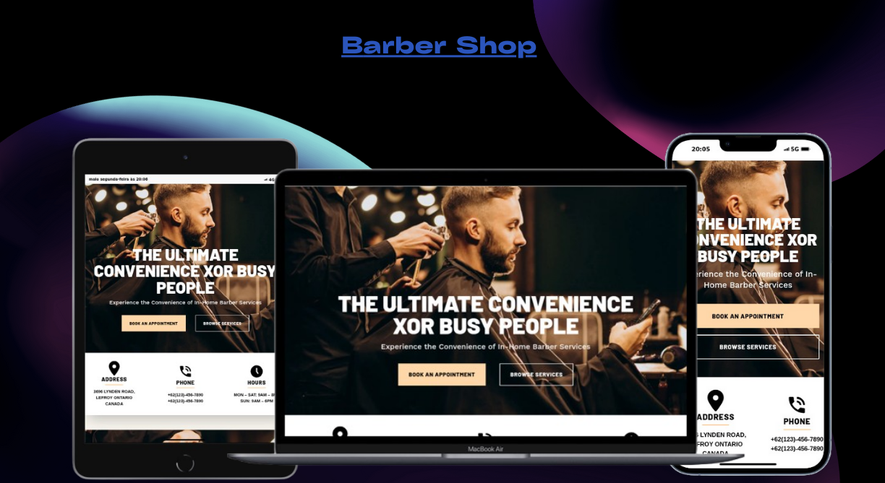

<h1 align="center">Barber Shop</h1>
<div align="center">
  <a href="#descrição">Descrição</a> |
  <a href="#iniciar">Iniciar</a> |
  <a href="#licença">Licença</a>
</div>

<p align="center">
  
</p>
<p>
 
</p>

## Descrição

O Site e uma landing page que, apresenta uma interface moderna e elegante, voltada para serviços de barbearia com foco em conveniência e qualidade. Ela oferece uma experiência visual limpa e responsiva, adaptando-se bem a dispositivos móveis e desktops

Acesse o site **[Barber Shop](https://barber-shop-eta-six.vercel.app/)**.

## Iniciar

E Necessário ter o Nodejs e o git instalado.

Faça clone do repositório localmente.

```bash
git clone https://github.com/matheus369k/barber-shop.git
cd ./barber-shop
```

Instale as dependencias

```bash
pnpm i
```

Crie um arquivo **.env**, com as variáveis ambientes abaixo

```bash
NEXT_PUBLIC_GEO_MAP_KEY=key
```

Agora você pode iniciar o projetos

```bash
pnpm dev
```

## Licença

Licença usada **[MIT](./LICENSE.txt)**
